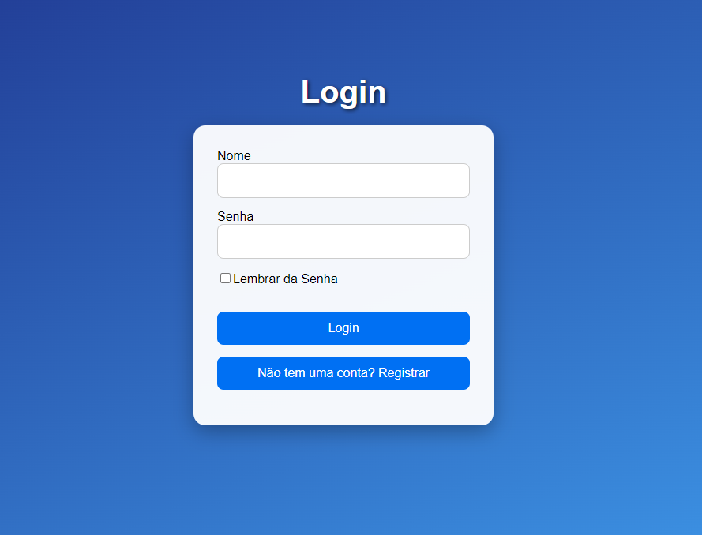
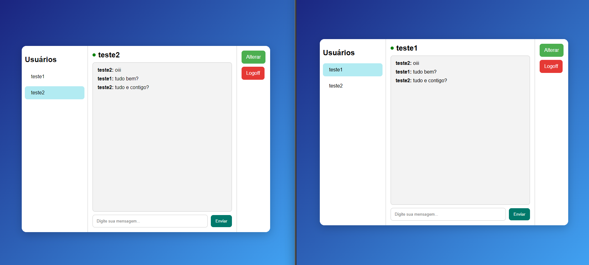
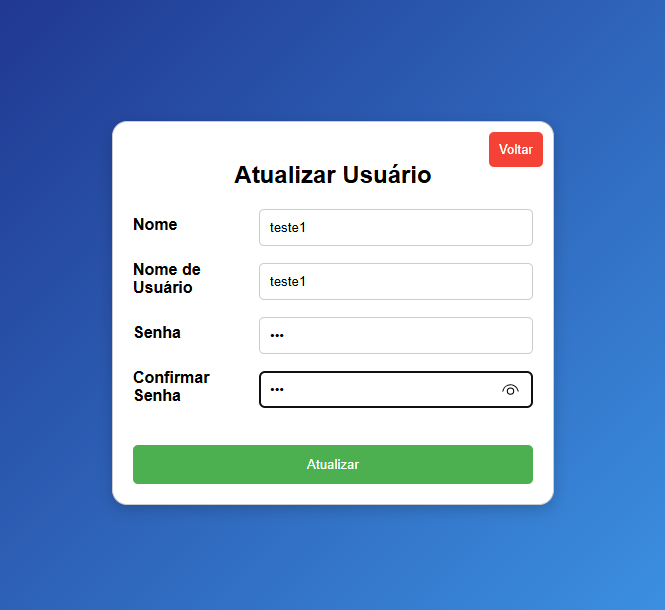

# Projeto Frontend

Este é um projeto frontend para um sistema de chat, desenvolvido em React e Next.js, utilizando Socket.IO para comunicação em tempo real. O sistema permite o login, cadastro de usuários e a troca de mensagens em um chat.
## Estrutura de arquivos
```
projeto-ixc-frontend
├── .next
├── components
│   └── ErrorMessage.js
├── pages
│   ├── _app.js
│   ├── chat.js
│   ├── login.js
│   ├── signup.js
│   └── update.js
├── styles
│   ├── ErrorMessage.module.css
│   ├── Login.module.css
│   ├── chat.module.css
│   ├── globals.css
│   └── update.module.css
├── package-lock.json
└── package.json

```
## Técnologias utilizadas

- [React](https://pt-br.react.dev/): Biblioteca para construir interfaces de usuário.
- [Next.js](https://nextjs.org/docs): Framework para React que permite a renderização do lado do servidor e o suporte a rotas.
- [Socket.IO](https://socket.io/pt-br/docs/v4/): Biblioteca para comunicação em tempo real entre cliente e servidor.
- [Axios](https://axios-http.com/ptbr/docs/intro): Biblioteca para fazer requisições HTTP.
- [CSS Modules](https://github.com/css-modules/css-modules): Para estilos isolados e modularizados.

# Estrutura do Projeto

# Tela de Login

A tela de login permite que usuários existentes acessem suas contas. Abaixo estão os detalhes principais sobre essa funcionalidade.

## Funcionalidades

- **Formulário de Login**: Usuários podem inserir suas credenciais, incluindo nome de usuário e senha.
- **Lembrar Senha**: Uma opção para lembrar as credenciais, armazenando-as no `localStorage`.
- **Mensagem de Sucesso ou Erro**: Mensagens são exibidas para indicar o sucesso ou a falha do login.
- **Conexão com Socket.IO**: Estabelece uma conexão com o servidor para comunicação em tempo real após o login bem-sucedido.
- **Redirecionamento para o Chat**: Após um login bem-sucedido, o usuário é redirecionado para a tela de chat.

## Estrutura do Componente

- **Hooks Utilizados**: 
  - `useState` para gerenciar os estados dos campos de entrada e da mensagem de feedback.
  - `useEffect` para verificar se as credenciais estão armazenadas no `localStorage`.
  - `useRouter` para navegação entre páginas.

- **Estilos**: Utiliza um arquivo CSS modular para estilização.

## Exemplo de Código: [chat.js](projeto-ixc-frontend/pages/login.js)



# Tela de Cadastro (Signup)

A tela de cadastro permite que novos usuários se registrem no sistema. Ela é composta pelos seguintes elementos:

## Funcionalidades

- **Formulário de Registro**: Os usuários podem inserir suas informações, incluindo nome, nome de usuário (username) e senha (password).
- **Validação**: Todos os campos do formulário são obrigatórios.
- **Mensagem de Sucesso**: Após um registro bem-sucedido, uma mensagem de confirmação é exibida, e o usuário é redirecionado para a página de login.
- **Tratamento de Erros**: Em caso de falha no registro, uma mensagem de erro é exibida.
- **Redirecionamento para Login**: Um botão permite que usuários que já possuem uma conta sejam direcionados para a tela de login.

## Estrutura do Componente

- **Hooks Utilizados**: 
  - `useState` para gerenciar os estados dos campos do formulário e da mensagem de feedback.
  - `useRouter` para navegação entre páginas.
  
- **Estilos**: Utiliza um arquivo CSS modular para estilização, garantindo que os estilos não conflitem com outros componentes.

## Exemplo de Código: [signup.js](projeto-ixc-frontend/pages/signup.js)


# Tela de Chat

A tela de chat permite que usuários se comuniquem em tempo real, enviando e recebendo mensagens instantaneamente. Abaixo estão os detalhes principais sobre essa funcionalidade.

## Funcionalidades

- **Mensagens em Tempo Real**: Usuários podem enviar e receber mensagens instantaneamente utilizando o Socket.IO.
- **Lista de Usuários**: Exibe todos os usuários disponíveis, com indicação de quais estão online.
- **Seleção de Usuário**: Usuários podem selecionar um contato para iniciar uma conversa.
- **Área de Mensagens**: Mostra a conversa atual entre o usuário selecionado e o usuário logado.
- **Notificações de Mensagens**: Exibe um popup quando uma nova mensagem é recebida.

## Estrutura do Componente

- **Hooks Utilizados**:
  - `messages`: Armazena as mensagens da conversa selecionada.
  - `inputValue`: Valor atual do campo de entrada da mensagem.
  - `users`: Lista de usuários disponíveis, com status de online/offline.
  - `selectedUser`: ID do usuário selecionado para conversa.
  - `fetchInterval`: Intervalo para buscar mensagens automaticamente.
  - `popupMessage`: Mensagem de notificação para novas mensagens recebidas.
  - `token`, `username`, `userId`: Informações do usuário logado.

- **Efeitos Colaterais**:
  - Lê informações do `localStorage` ao montar o componente e redireciona para login se o token não estiver disponível.
  - Conecta ao Socket.IO e escuta eventos como atualizações de usuários e recebimento de mensagens.
  - Executa chamadas para buscar usuários e mensagens.

- **Funções**:
  - `handleSelectUser`: Seleciona um usuário e busca suas mensagens.
  - `fetchMessages`: Busca mensagens entre o usuário logado e o usuário selecionado.
  - `handleSendMessage`: Envia uma nova mensagem.
  - `handleLogoff`: Desloga o usuário e limpa o `localStorage`.

- **Estilos**: Utiliza um arquivo CSS modular para estilização, garantindo que os estilos não conflitem com outros componentes.

## Exemplo de Código [chat.js](projeto-ixc-frontend/pages/chat.js)



# Tela de Atualização (Update)

A tela de atualização permite que usuários atualizem suas informações pessoais no sistema. Ela é composta pelos seguintes elementos:

## Funcionalidades

- **Formulário de Atualização**: Usuários podem inserir suas novas informações, incluindo nome, nome de usuário (username) e senha.
- **Validação de Senhas**: As senhas precisam coincidir para que a atualização seja realizada.
- **Mensagem de Sucesso**: Após uma atualização bem-sucedida, uma mensagem de confirmação é exibida, e o usuário é redirecionado para a página de login.
- **Tratamento de Erros**: Em caso de falha na atualização, uma mensagem de erro é exibida.
- **Redirecionamento para Tela de Chat**: Um botão permite que usuários voltem para a tela de chat.

## Estrutura do Componente

- **Hooks Utilizados**:
  - `useState` para gerenciar os estados dos campos do formulário, da mensagem de feedback, e das informações do usuário.
  - `useEffect` para verificar a autenticação do usuário e redirecionar se necessário.
  - `useRouter` para navegação entre páginas.

- **Efeitos Colaterais**:
  - Lê informações do `localStorage` ao montar o componente para verificar se o usuário está autenticado.
  - Exibe uma mensagem de carregamento enquanto verifica a autenticação.
  - Redireciona para a página de login se o usuário não estiver autenticado.

## Exemplo de Código: [update.js](projeto-ixc-frontend/pages/update.js)

